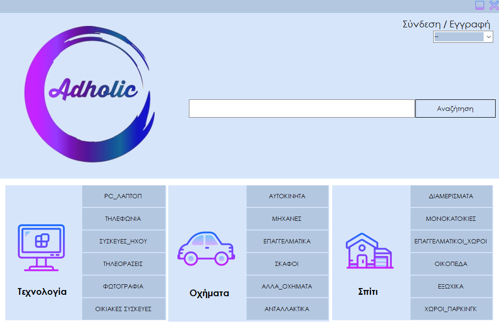

# AggeliesProject





> Μια πρώτη εικόνα από την αρχική σελίδα του προγράμματος

---

###  Πίνακας Περιεχομένων


- [Περιγραφή](#περιγραφή)
- [Xαρακτηριστικά](#χαρακτηριστικά)
- [Τεχνολογίες](#τεχνολογίες)
---

## Περιγραφή

Το παρόν project αποτελεί συνέχεια  απο την ομαδική εργασία που έγινε στα πλαίσια του μαθήματος  <a href="https://sites.google.com/view/adopse-iee-dipae/coursesyllabus?authuser=0"> ΑΔΟΠΣΕ</a>.Τo αρχικό project βρίσκεται  σε αυτο το <a href="https://github.com/AchilleasGekas/Adopse/tree/master/teliko_solution"> github repo</a>.
<br/>
 Το adholic ειναι μια εφαρμογη στην οποια μπορεις να αναζητησεις προιοντα απο μια μεγαλη γκαμα απο ειδη τεχνολογιας,οχηματα μεχρι και σπιτια και αν θες εγγραφεσαι και μπορεις να ανεβασεις την δικια σου  αγγελια χωρις καποιο κοστος εκτος αν θελει να κανει καποιος δωρεά. 
 <br/><br/>
[Back To The Top](#aggeliesproject)


---

## Xαρακτηριστικά
- Συνδεση/Εγγραφη Χρηστη
- Μπαρα αναζητησης
- Φιλτρα αναζητησης 
- Customer Support 
- Price Discount
- Favorite button
- Donation(Paypal)
- Report button
- Παρακολουθηση χρηστη (login,αναζητηση)
- Γραφημα αναζητησης χρηστων

[Back To The Top](#aggeliesproject)


---

## Τεχνολογίες

- C#
- Lucene.Net(για την αναζητηση)
- Visual Studio 2019

[Back To The Top](#aggeliesproject)

---

## How To Use

#### Installation


#### API Reference

```html
    <p>dummy code</p>
```
[Back To The Top](#aggeliesproject)

---