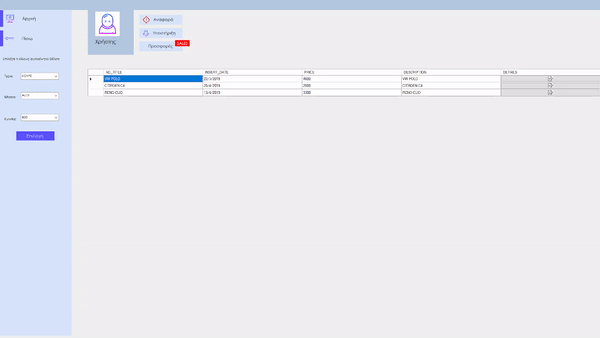
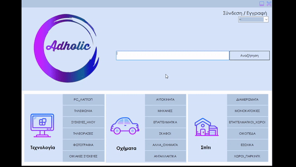
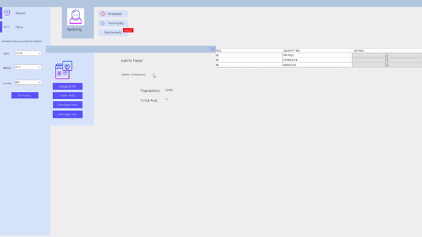
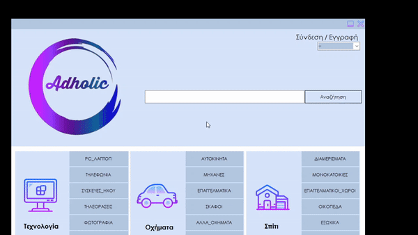

# AggeliesProject

> Μια πρώτη εικόνα από την αρχική σελίδα του προγράμματος

---

###  Πίνακας Περιεχομένων

- [Περιγραφή](#περιγραφή)
- [Xαρακτηριστικά](#χαρακτηριστικά)
- [Τεχνολογίες](#τεχνολογίες)
- [Highlights](#Highlights)
---

## Περιγραφή

Το παρόν project αποτελεί συνέχεια  απο την ομαδική εργασία που έγινε στα πλαίσια του μαθήματος  <a href="https://sites.google.com/view/adopse-iee-dipae/coursesyllabus?authuser=0"> ΑΔΟΠΣΕ</a>.Τo αρχικό project βρίσκεται  σε αυτο το <a href="https://github.com/AchilleasGekas/Adopse/tree/master/teliko_solution"> Github repo</a>.
 
 Το adholic είναι μια εφαρμογή στην οποία μπορείς να αναζητήσεις προιόντα από μια μεγάλη γκάμα από είδη τεχνολογίας,οχήματα μέχρι και σπίτια και αν θες εγγράφεσαι και μπορείς να ανεβάσεις την δικία σου  αγγελία χωρίς κάποιο κόστος εκτός αν θέλει να κάνει κάποιος δωρεά. 
   
[Back To The Top](#aggeliesproject)

---

## Xαρακτηριστικά
- Σύνδεση/Εγγραφή Χρήστη
- Μπάρα αναζήτησης
- Φίλτρα αναζήτησης 
- Customer Support 
- Price Discount
- Favorite button
- Donation(Paypal)
- Report button
- Παρακολούθηση χρήστη (login,αναζήτηση)
- Γράφημα αναζήτησης χρηστών

[Back To The Top](#aggeliesproject)

---

## Τεχνολογίες

- C#
- Lucene.Net(για την αναζήτηση)
- Visual Studio 2019

[Back To The Top](#aggeliesproject)

---

## Highlights

> Γρήγορη ματιά στην εφαρμογή
 

> Λειτουργία της μπάρας αναζήτησης με το Lucene.net

> "Παρακολούθηση χρηστών"

> Xρήση φίλτρων
 

[Back To The Top](#aggeliesproject)

---